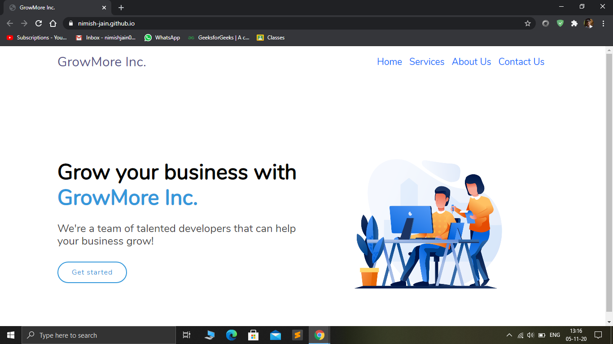
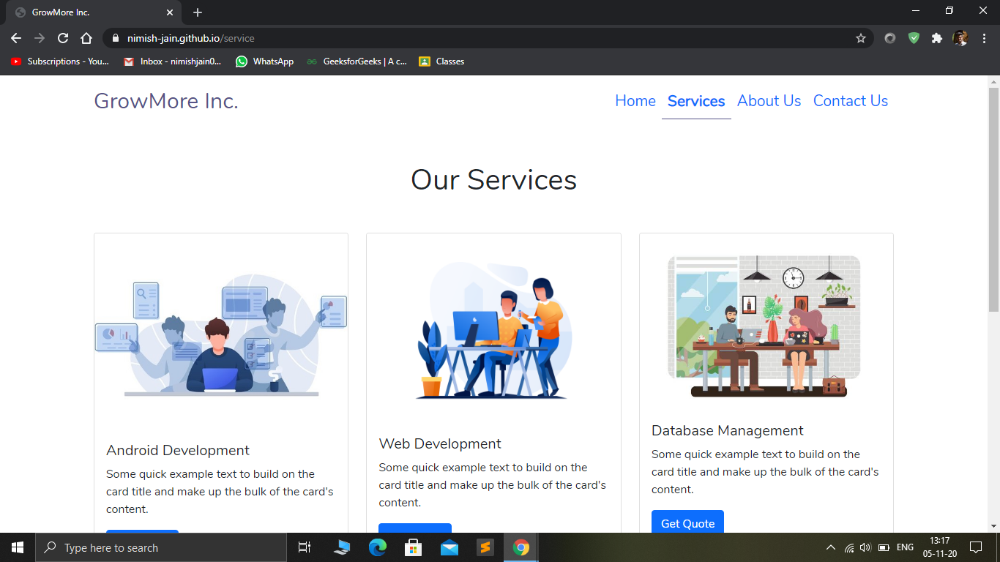
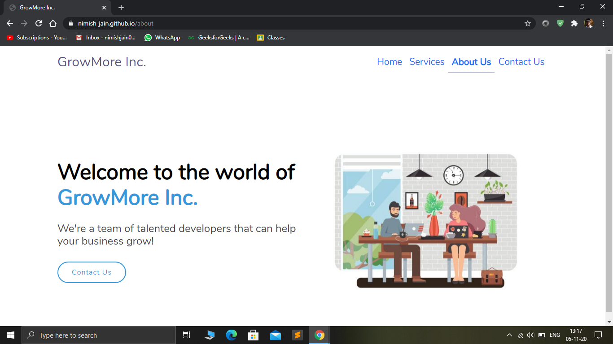
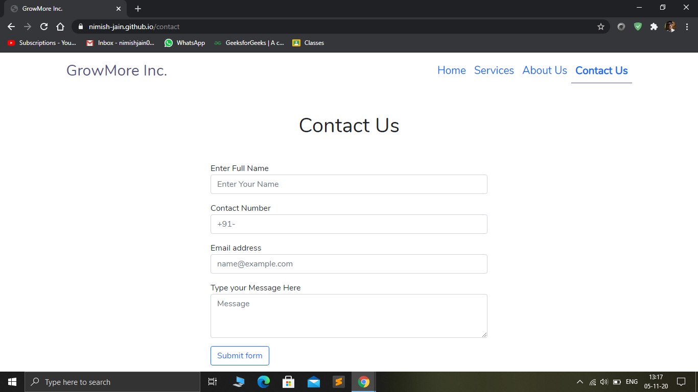

## Company Website using React JS

A Prototype Website (Frontend Only) created for a modern service based company GrowMore. This website has been built using the concepts of React JS, React Router DOM and Bootstrap. Hosting done using gh-pages.

The website is functional & can be tested live at the following link : https://nimish-jain.github.io/Company-Website-React/

Here are some Screenshots from the Live Website

